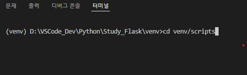

# 2. 나의 컴퓨터에 개발환경 셋팅

# 2 나의 컴퓨터에 개발환경 셋팅

**플라스크 가상환경**&#x20;

1. 가상환경 만들기


2\. 가상환경 실행하기




&#x20;3\. pip upgrade(for window)

```
python -m pip install --upgrade pip
```


4\. 플라스크 설치

```
pip install flask
```


**플라스크 기본 코드**

```
from flask import Flask

app = Flask(__name__)

@app.route('/')
def index():
    return 'hello'

app.run(port=8080, debug=True)

```
